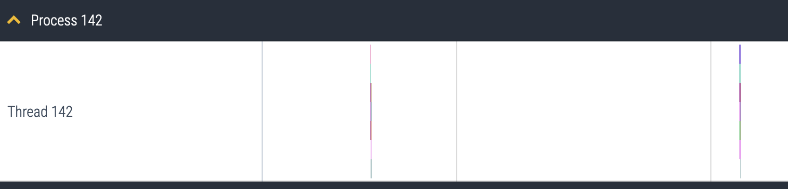
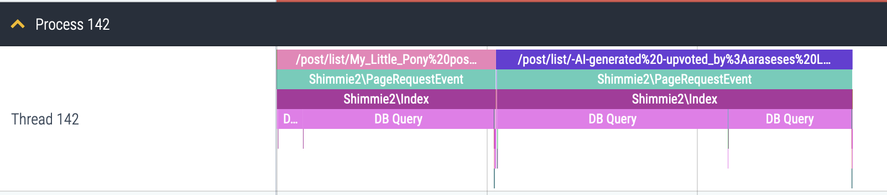

EventTracer Time Dilator
========================
Removes empty gaps in chrome event traces

Why
---
Because my webapp records event traces in RAM with every request, and dumps them to disk only if a request takes longer than a second. This means that I typically have one 1-2 second long trace, then a couple of hours of empty space, and then another 1-2 second trace. This is a pain to navigate beacuse there's so much empty space.

Before:

After:
